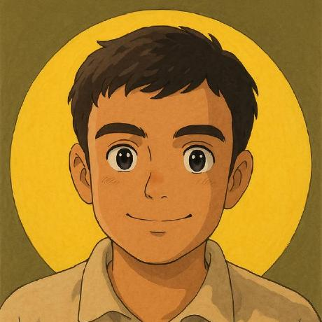

<h1 style="color:#ffcc00; position:relative; display:flex; justify-content:center; font-size:46px">Welcome to my portfolio</h1>

## Home

    

## About

Hello! I'm Ipsit Das, an undergraduate student pursuing a B.Tech. degree in Computer Science and Engineering at the National Institute of Technology, Andhra Pradesh. With a passion for machine learning and artificial intelligence, I am committed to continuously learning and contributing to impactful AI-driven projects.

As a dedicated and responsible student, I have developed a strong foundation in various domains of computer science. My expertise includes working with frameworks like PyTorch, Express and React, which I have applied in numerous projects.

I enjoy coding and am particularly passionate about exploring the latest advancements in AI and machine learning. So welcome to my world!! 😊

## Skills
So let me speak something about my skills. 

  

    Python 
  

  

    C++
  

  

    Java Script
  

  

    Java
  

  

    SQL
  

  

    pyTorch
  

  

    React
  

  

    Express
  

  

    Machine learning 
  

  

    Natural Language Processing
  

  

    Computer Vision
  

## Achievements
Here, there are few of my achievements😅
- Over 450 problems on [leetcode](https://www.leetcode.com/icode100)
- I have been in the top 26% of the leetcoders in the weekly contest with highest rating of 1578
- I also secured position in the top 1% among 16686 students in [NPTEL Online Certification Examination for Cloud Computing](https://drive.google.com/file/d/11kcgGLjRE6sQyTxL6D0mjccPphTeCCGf/view) (Click on the link to view the certificate 😌)
- I dont know if it is an achievement, but I recently scored a semeter grade point of 9.08 in my 6th semester of college😁

## Projects
Here !! Let me show you some work I did ...
Want to see right???🥹🥹

Here's just the recent ones for more apps and code checkout my [github account](https://www.github.com/icode100) 😊

    

        <u><b style="font-size:16px"> POS Tagger using HMM</b></u>
        
        
This is a pos tagger that I made using Hidden Markov Model and I used Viterbi decoding for it. Click on the image to check out the app.

    

    

        <u><b style="font-size:16px"> Real Image to Anime Image using neural style transfer</b></u>
        
        
This is an interesting one you know!!! So what it does is it will take an image and then convert it into anime styled images and not just that, It does that in two styles one of Hayao Miyazaki and other being Makoto Shinkai. I have used here cycleGAN to make it. Check out the github page for code and more info on it 

    

    

        <u><b style="font-size:16px"> Image Captioning using ViT and RoBERTa</b></u>
        
        
This is an image captioning app that I made using Vision Transformer and RoBERTa.Then I fine-tuned the model on flickr10k dataset. I used huggingface and pytorch for it. I hope you will have fun generating captions with it 😌. Sorry Forgot to say... Click on the image to open the application 😁

    

## Leetcode
These are my leetcode stats. Check me out on [icode100](https://leetcode.com/icode100) 😊

## Resume
<iframe src="https://docs.google.com/document/d/15748BDn19wP__MkvK9YigI-pReUwZtTdCU5KHjA17Ik/pub?embedded=true"></iframe>

## Contact
Reach Me out on:

  
  
  

